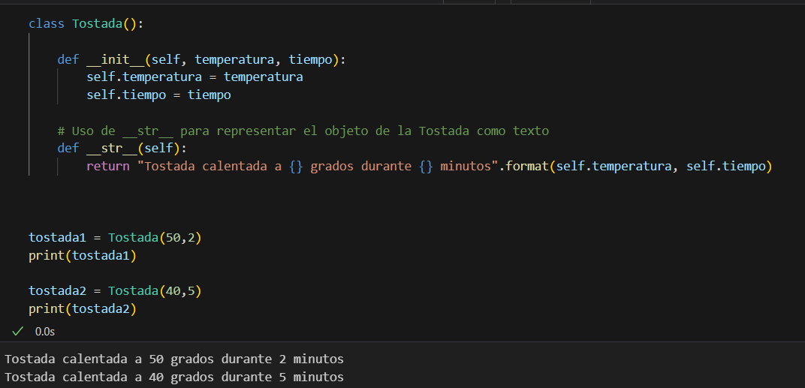
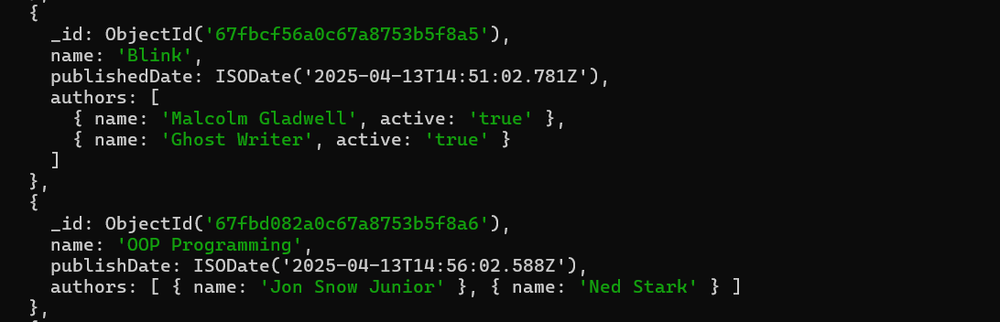
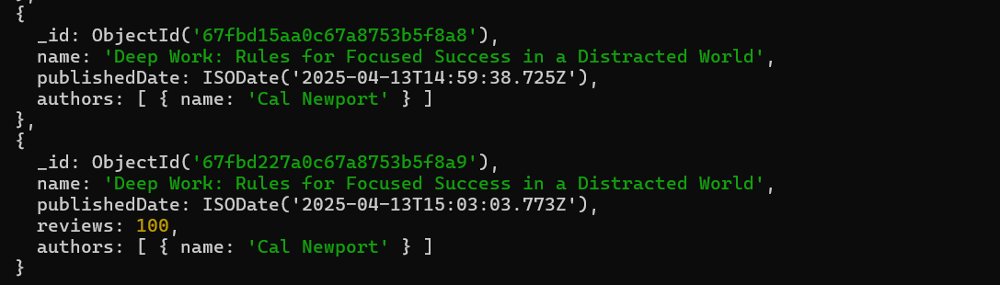
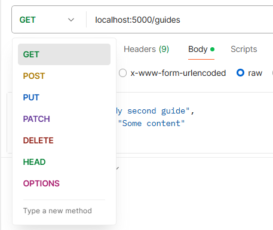
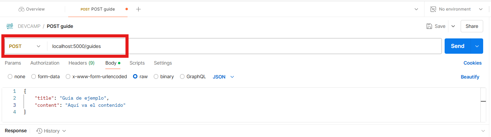
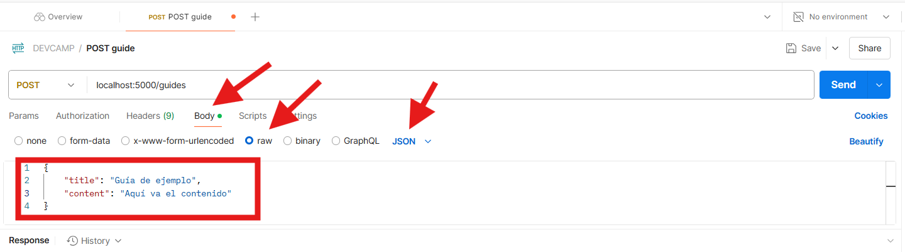
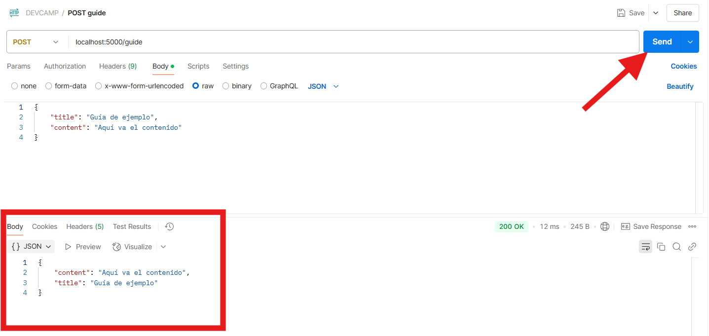
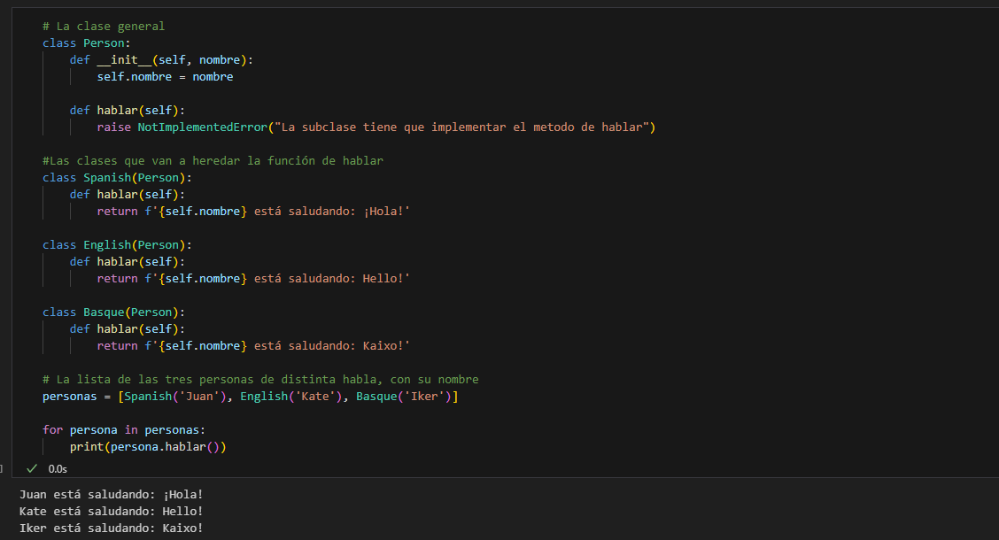

# Documentación - Checkpoint 6

## **¿Para qué usamos Clases en Python?**

En Python, las **clases** se utilizan para crear **objetos** y estas empaquetan datos (atributos) y funcionalidad (métodos). Esto permite crear nuevas instancias del tipo de objeto. Además, las clases pueden tener atributos que se inician usando \_\_init\_\_, lo que configura los objetos cuando se crean. El primer parámetro sería self, que es la instancia del objeto que se está creando y donde se pueden asignar valores a los atributos.

Para poder comprenderlo de una forma más visual, vamos a imaginar que estamos creando la clase Tostadora:

El objeto que se crea sería una tostada y cada una de las tostadas que salen de la tostadora serían las instancias. La tostadora se puede configurar usando \_\_init\_\_, por ejemplo dandole los atributos de temperatura y tiempo junto a self que sería el primer argumento. Cada una de las tostadas (instancias) puede tener su propia temperatura (self.temperatura = temperatura) y tiempo (self.tiempo = tiempo) de tostado, por lo que cada tostada que sale de la tostadora (objeto) será una instancia distinta. Por lo tanto, como se puede ver, las clases se usan como una especie de plantillas para crear múltiples objetos que tengan características y funcionalidades similares.



## **¿Qué método se ejecuta automáticamente cuando se crea una instancia de una clase?**

Como he mencionado en el apartado anterior, el método que se ejecuta automáticamente es el de \_\_init\_\_ (*Dunder init*). Este método es el **constructor** de la clase e inicializa los atributos del objeto. Al llamar a la clase, por ejemplo a en tostada1, mediante self, \_\_init\_\_ inicia la temperatura que se ha pasado de 50 y la temperatura que se ha pasado de 2, por lo que gracias a este constructor, la nueva instancia de Tostada tiene los atributos de 50 grados y 2 minutos de tostado.

## **¿Qué es una API? y ¿Cuáles son los tres verbos de API?**

Una API (Application Programming Interface o Interfaz de Programación de Aplicaciones), son reglas, protocolos y heraramientas para que distintos programas de software se comuniquen entre ellos. Es decir, cualquier componente de software que sea intermediario entre dos apliccaiones desconectadas, por ejemplo, una aplicación con una base de datos (MySQL, MongoDB...). Los tres verbos más comunes (o populares) de una API son GET, POST y PUT. Vamos a poner el ejemplo de una API que esté conectando a una base de datos de  books que contiene información sobre libros:

 * **GET:** Se usa cuando quieres **obtener/extraer** la información. Con GET /books se solicita y visualiza la lista de los libros que tenga disponible.

 * **POST:** Se usa para **añadir/enviar** datos. Por ejemplo si acaba de salir un nuevo libro y no se encuentra dentro de la base de datos, usando POST /books se puede crear el nuevo libro y añadir por ejemplo el título, autor etc.

 * **PUT:** Se usa para **actualizar** recursos. Es decir, si por ejemplo en la base de datos hubiese un libro que tenía algún fallo y se quiere reemplazar completamente por la nueva versión.

 Además de estos verbos, existen otros como DELETE para eliminar recursos o PATCH para modificar un recurso parcialmente, entre otros (HEAD, OPTIONS, TRACE, CONNECT).

## **¿Es MongoDB una base de datos SQL o NoSQL?**

MongoDB es una base de datos NoSQL. Esto significa que no se guardan los datos como lo hace SQL en tablas con filas y columnas. MongoDB almacena los datos en documentos con estructuras similares a los archivos JSON (estructura de pares clave-valor), por ejemplo la siguiente estructura:



Al no ser una base de datos SQL, no tiene un esquema predeterminado, por lo que se pueden tener distintas estructuras en una misma colección, por ejemplo: 



Como se puede ver, ambos son parte de una misma colección (books), pero el primer libro tiene el id (viene por defecto), nombre, data de publicación y autores, y el segundo libro también tiene el apartado de reviews.

Además, tiene su propio lenguaje de consulta, por ejemplo, esta sería la diferencia entre hacer una búsqueda del libro "OOP Programming" en SQL vs NoSQL.

* **NoSQL:** db.books.find({name: 'OOP Programming'})

* **Equivalente en SQL:** SELECT * from books WHERE name = 'OOP Programming'

## **¿Qué es Postman?**

Postman es una plicación que te permite comunicarte con APIs externas. Es una herramienta útil para poder transferir/recibir datos y no es específico de un lenguaje de programación o framework, por lo que lo hace muy versatil para desarrolladores de distintos lenguajes de programación (Python, JavaScript, etc.). Generalmente se usa para probar, depurar y/o documentar APIs.
Postman tiene una interfaz intuitiva donde puedes seleccionar los verbos de API que deseas ejecutar:



Los primeros son los más utilizados, como anteriormente he mencionado: **GET, POST y PUT**

Vamos a ver un ejemplo de cómo se usa postman usando Flask. Vamos a poner el ejemplo del uso de **POST** en postman y vamos a ver como se configura desde el inicio.


En un archivo python vamos a crear app.py y se va a configurar de la siguiente forma:

1. **Importar las clases y funciones necesarias del framework. En este caso vamos a importar las siguientes:**

```
from flask import Flask, request, jsonify
from flask_sqlalchemy import SQLAlchemy
from flask_marshmallow import Marshmallow
import os
```
Para ello, es necesario tener instalado flask, flask_alchemy y flask_marshmallow, por ejemplo mediante pip.

2. Crear la Aplicación Flask:

```
app = Flask(__name__)
```

3. **Configurar la base de datos que vamos a utilizar.** Aquí lo que hacemos es configurar la conexión a SQLite usando app.sqlite y se crea en la misma carpeta donde está localizado este archivo. SQLAlchemy es lo que permite que interactuemos con la base de dato usando Python. Marshmallow es lo que permite que se tengan los formatos en tipo JSON en las respuestas de la API.

```
basedir = os.path.abspath(os.path.dirname(__file__))
app.config['SQLALCHEMY_DATABASE_URI'] = 'sqlite:///' + os.path.join(basedir, 'app.sqlite')
db = SQLAlchemy(app)
ma = Marshmallow(app)
```

4. **Definir el modelo de la base de datos, al que le vamos a llamar Guide.** Esto es lo que le va a dar la estructura a la tabla guide que vamos a crear en la base de datos. En este ejemplo le hemos añadido los campos de id, título (title) y contenido (content).

```
class Guide(db.Model):
    id = db.Column(db.Integer, primary_key=True)
    title = db.Column(db.String(100), unique=False)
    content = db.Column(db.String(144), unique=False)

    def \_\_init\_\_(self, title, content):
        self.title = title
        self.content = content
```

5. **Definir el esquema.** Este apartado es el que va a decir a Marshmallow los campos que queremos incluir cuando pasemos un objeto Guide a formato JSON. En este caso, title y content.

```
class GuideSchema(ma.Schema):
    class Meta:
        fields = ('title', 'content')
```

6. **Crear instancias del esquema.** Aquí se pueden crear de un solo objeto o de lista de objetos. Para ello, se configura usando many=True:

```
guide_schema = GuideSchema()
guides_schema = GuideSchema(many=True)
```

7. **Una vez configurada la base de datos, hay que definir los endpoints de la API.** Estos se usan para ejecutar las funciones a la API. Para crear la nueva guia que vamos a denominar guide, se usa el método **POST**. El endpoint para esto sería el siguiente:

```
@app.route('/guide', methods=["POST"])
def add_guide():
    title = request.json['title']
    content = request.json['content']

    new_guide = Guide(title, content)

    db.session.add(new_guide)
    db.session.commit()

    guide = Guide.query.get(new_guide.id)

    return guide_schema.jsonify(guide)
```

@app.route('/guide', methods=["POST"]) es lo que define la ruta en /guide y la solicitud que acepta es la de post. Después, en la funcion add_guide() se escribe lo que se quiere ejecutar cuando se llame a la función **POST**, en este caso se hacen request (peticiones) que obtienen los valores del titulo y del contenido en la solicutud JSON. Con Guide(title, content) se crean instancias del modelo Guide con los datos que se han pasado, se añaden a la base de datos con db.session.add(new_guide) y se guardan los cambios usando db.session.commit() (comandos que son similares a los que se usan con Git para añadir y guardar los datos). Debido a que el id se guarda de forma automática (solo le hemos pasado título y contenido), se usa Guide.query.get(new_guide.id) para recuperar su id y poder devolver la guia recién creada en la base de datos para poder visualizarla en el return guide_schema.jsonify(guide). Aquí hemos usado guide_schema en vez de guide_schemas porque vamos añadir un solo objeto de prueba.

Ahora que tenemos la configuración completa para el **POST**, ejecutamos el archivo app.py y nos vamos a postman.

Lo primero es configurar la ruta de la guía que se encuentra en nuestro localhost y vamos a seleccionar el método **POST**



En la parte inferior vamos a escribir los valores que hemos fijado como necesarios para nuestra guia, el título y el contenido. Para ello tenemos que estar en Body > raw y tener JSON seleccionado.



Una vez colocada la nueva guia con su título y su contenido, se pulsa el botón de send y debajo aparece en formato JSON la guia que acabamos de insertar:



Así es como se usa postman. Para poder visualizar/obtener los datos de la guía, habría que crear una nueva @app.route para configurar GET, y lo mismo para cada tipo de acción que se quiera realizar (PUT, DELETE, etc.)

## **¿Qué es el polimorfismo?**

El polimorfismo se usa en programación orientada a objetos y es la capacidad que tienen objetos de distintas clases a responder a una misma llamada de forma distinta. Es decir, de muchas formas, ya que es la definicion literal de polimorfismo.
Para poder entenderlo, vamos a poner un ejemplo. Imaginemos que tenemos tres personas, una habla Español, otra Inglés y otra Euskera. Las tres personas pueden saludar, pero cada persona lo hará de forma distinta. Vamos a ver esto en código.

Comenzamos creando la clase de persona Person que va a tener el argumento de nombre. En esta clase también vamos a meter la función de hablar:

```
class Person:
    def __init__(self, nombre):
        self.nombre = nombre

    def hablar(self):
        raise NotImplementedError("La subclase tiene que implementar el metodo de hablar")
```

La clase persona sería la clase genérica que van a tener, debido a que todos son personas, y además tiene el método de hablar. En este método hablar se usa raise NotImplementedError porque está pensado para ser heredado por otras clases. En este caso tendríamos tres clases que representarian a las tres personas de los distintos idiomas:

```
class Spanish(Person):
    def hablar(self):
        return f'{self.nombre} está saludando: ¡Hola!'

class English(Person):
    def hablar(self):
        return f'{self.nombre} está saludando: Hello!'

class Basque(Person):
    def hablar(self):
        return f'{self.nombre} está saludando: Kaixo!'

```

Como se puede observar, las tres clases heredan el método de hablar pasando la clase Persona en cada una de las nuevas clases, pero cada una tiene su propio saludo. Esto sería el polimorfismo, ya que todos tienen la función hablar heredada de la misma clase Person, pero cada uno de ellos tiene su propio return según el idioma que hablen. 

Si listamos tres personas e imprimimos lo que diría cada uno, tendríamos este resultado:



## **¿Qué es un método dunder?**

Un método dunder (**d**ouble **under**score) es un método especial que comienza y finaliza por doble guión bajo: \_\_metodo\_\_ 
Estos métodos son una especie de instrucciones especiales que Python entiende y usa de forma automática en clases y objetos. Por ejemplo, anteriormente ya hemos usado dunder init y dunder str en la clase Tostada. Dunder init sería la instrucción de inicialización y creación de los atributos del objeto. También hemos visto dunder str dentro de la clase Tostada y, en este caso, sería la instrucción de qué debe mostrarse al usar la función print. Además de estos métodos dunder hay otros como len o getitem. La idea de estos métodos al final es que se llamen de forma automática sin tener que especificarlos de forma explícita cada vez que llamas a la clase. 

## **¿Qué es un decorador de python?**

Un decorador en Python es una forma de poder cambiar o extender la funcionalidad que tiene una función o un método. Es decir, es una función que recibe una funcion extra para añadirle una nueva funcinoalidad, pero sin tener que modificar el código original. Vamos a poner el ejemplo de una ventana que queremos que se cierre si está abierta:

```
class Ventana:
    def __init__(self, abierta):
        self._abierta = False   # Digamos que por defecto la ventana está cerrada
    
    def cerrar(self):
        if self._abierta == True:   # Mirar si la ventana está cerrada, es decir, si es False
            self._abierta = False   # Cerramos la ventana
            return "Cerrando ventana"
        return "La ventana ya está cerrada"
    
    @property
    def estado(self):
        if self._abierta == True:
            return "La ventana está abierta"
        else:
            return "La ventana está cerrada"
```

En este ejemplo tenemos la clase ventana que tiene el atributo de estar abierta. De base vamos a decir que es falso, es decir, que la ventana se encuentra cerrada. Como podemos observar, tenemos un guión bajo antes de abierta (_abierta), lo que significa que es un atributo protegido, es decir, no se puede modificar directamente fuera de la clase.

Posteriorente, tenemos la función que deseamos que se realice, la de cerrar. Aquí la función analiza si está abierta o no. En caso de True (ventana abierta) devuelve "Cerrando ventana", por lo contrario, si ya está cerrada (self._abierta = False), devuelve "La ventana ya está cerrada". 

Ahora, hasta aquí sólo se permite cerrar la ventana, pero imaginemos que solamente queremos saber el estado de la ventana, es decir, si está abierta o cerrada. Para ello añadimos un decorador. Para acceder al estado de la ventrana como atributo usamos @property que es el decorador en este caso. @property permite acceder al resultado del método estado() usando sintaxis de atributos, es decir, ventana.estado en vez de ventana.estado(). Es una forma de interactuar con el método para devolder el valor que tiene _abierta aunque sea un atributo protegido. Así se puede acceder a la información del estado como si fuera un atributo en vez de llamar directamente al método.